# **Telecom Customer Churn Prediction**

        

**Telecom Customer Churn Prediction App live at:**   

An end-to-end **Data Analytics + Machine Learning project** that analyzes telecom customer behavior and predicts churn using a deployed **Streamlit web application**.

### Problem Statement:

Telecom companies face significant revenue loss due to customer churn. The problem is to analyze customer data to understand the patterns and factors leading to churn, and to build a machine learning model that can accurately predict which customers are likely to leave. This enables businesses to take proactive actions to improve customer retention.

Churn: The rate at which customers stop doing business with the company, often measures as the percentage of lost customers or subscribers over a specific period.

**Task:** Why customers are churning out? What are the characteristics of those customers who are churners? How to retain them? Predict who will churn in future?

---

### Project Executive Summary:

This project focuses on performing in-depth Exploratory Data Analysis (EDA) on telecom dataset to get insights. The objective is to conducting univariate and bivariate analyses to identify insights about churners and provide **actionable business recommendations** to improve retention and reduce revenue loss. Predict which customers are likely to leave a telecom service using historical data.

This helps telecom companies reduce churn, improve customer retention, and increase revenue.

The analysis follows a structured approach:

-   Implementing data cleaning and preprocessing techniques for real-world data.
    
-   Showcasing key churn drivers
    
-   Univariate analysis
    
-   Bivariate analysis
    
-   Generating insightful EDA reports highlighting key churn drivers.
    
-   A predictive model that accurately identifies customers at risk of churning.
    
-   An interactive Streamlit web application for predicting churn probability.
    
-   A deployed machine learning application.
  
--- 

### Data Understanding:

The dataset contains **7032 customer records**.

#### Key Features:

-   `gender` – Customer gender
    
-   `SeniorCitizen` – Whether customer is senior
    
-   `tenure` – Number of months with company
    
-   `Contract` – Contract type
    
-   `PaymentMethod` – Payment type
    
-   `MonthlyCharges` – Monthly bill
    
-   `TotalCharges` – Total amount paid
    
-   `Churn` – Target variable (Yes/No)
    

#### Telcome customer churn rate:

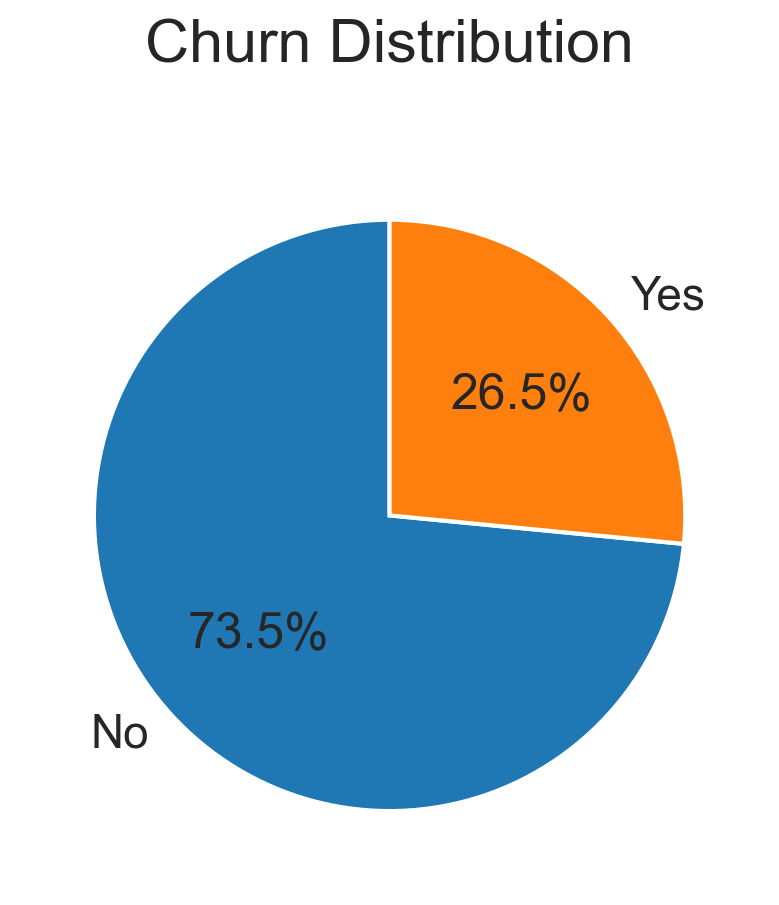

-   Data is highly imbalanced, ratio is almost 73:26.
-   73.5% of customers are active and rest are churned.
-   Therefore, we need to analyse the data with other features while taking the target value (churn) separately to get some insights.

#### Missing Data: 

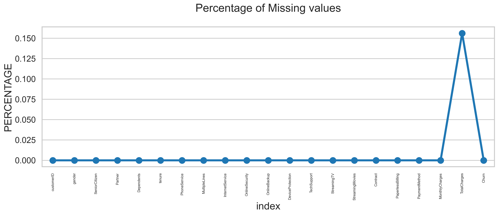

11/7043*100 = 0.156% of missing values in TotalCharges column. Since this is a very small percentage, we can choose to drop these rows without significantly affecting our analysis.

#### Initial intuition from the data:
Initially, there were no null values. But, we understood that TotalCharges was not in the correct format to analyse, so we converted into numeric data type, then we got around 0.156% of null values

---
### Univariate Analysis:
Study how categories break down between churned and non-churned groups.

<table>
  <tr>
    <td>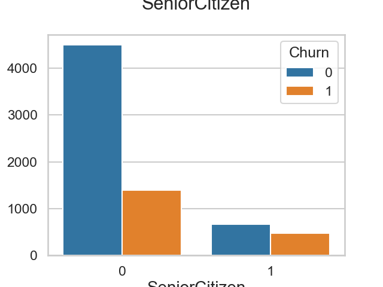</td>
    <td>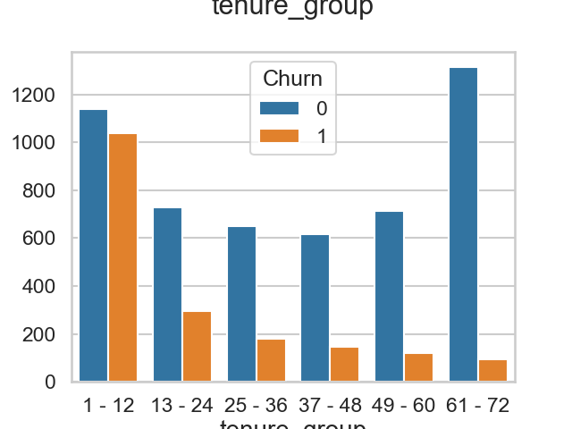</td>
    <td>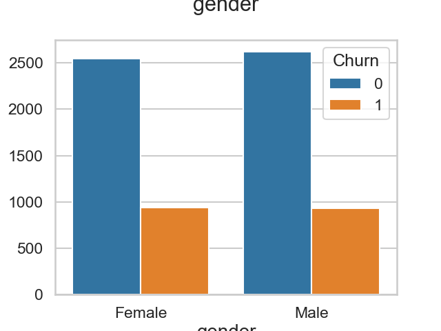</td>
  </tr>
  <tr>
    <td>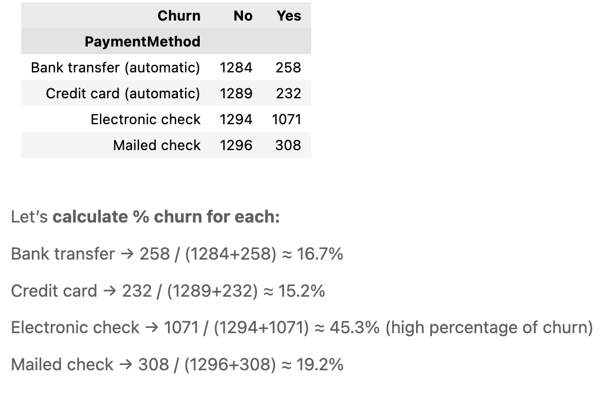</td>
    <td>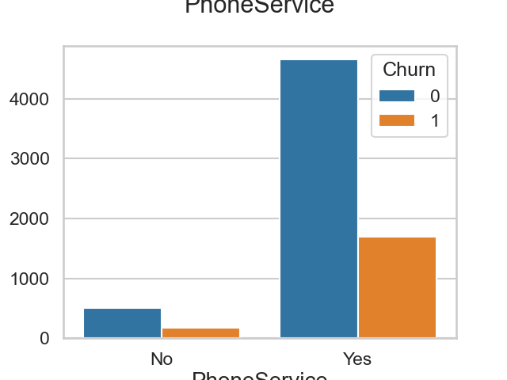</td>
    <td>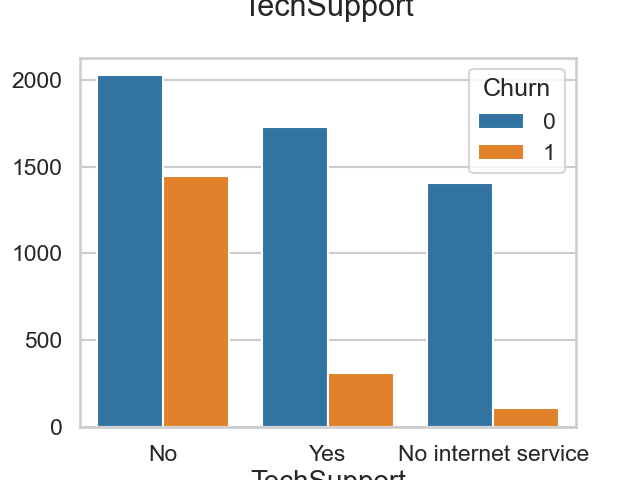</td>
  </tr>
  <tr>
    <td>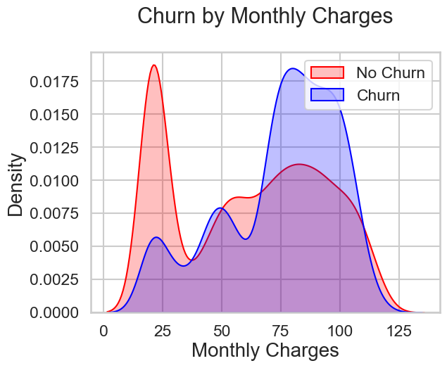</td>
    <td>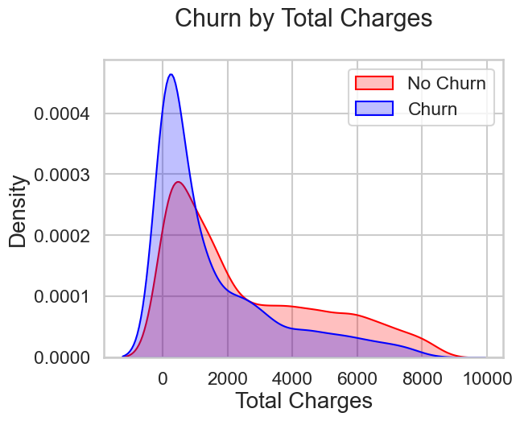</td>
    <td>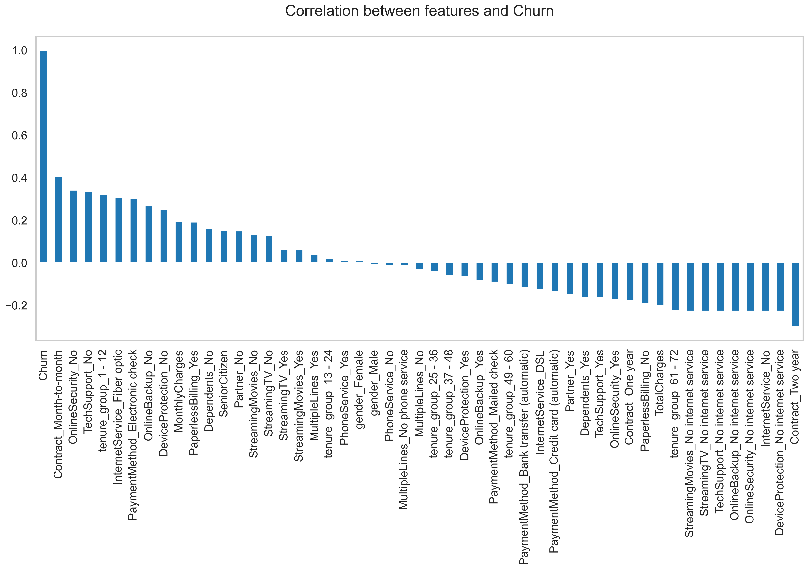</td>
  </tr>
  <tr>
    <td>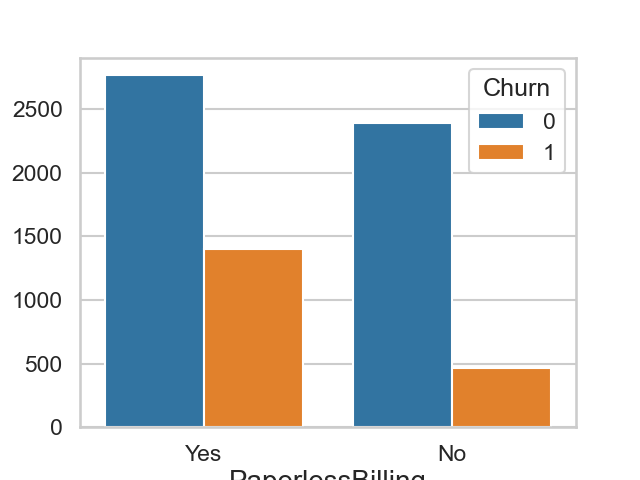</td>
    <td>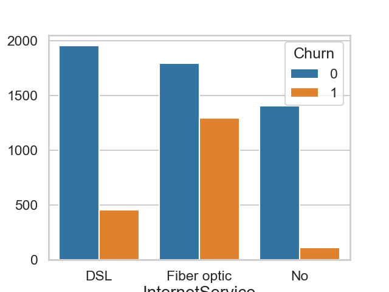</td>
    <td>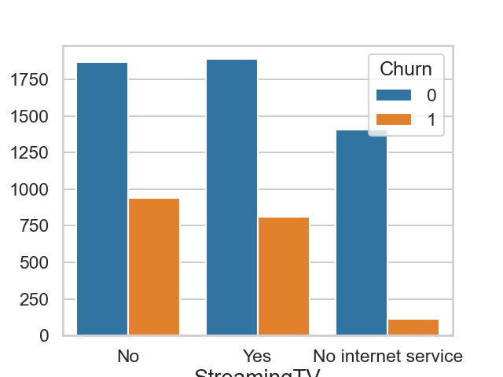</td>
  </tr>

</table>

**Findings:**
1. **SeniorCitizen:** higher percentage of senior citizens (those aged 65 and above) are churning compared to non-senior citizens. This suggests that age may be a factor in customer churn, and the company may want to consider targeted retention strategies for this demographic. Senior citizens are more likely to churn.
   
2. **Tenure group:** 41.46% of customers from 1-12 months (shorter tenure group) are churning. Company may need to focus on improving the onboarding experience and providing incentives for new customers to stay longer.

3. **Gender:** Distribution of churn appears similar between male and female.

4. **Payment method:** Customers using electronic check exhibit a significantly higher churn rate (~45%) compared to customers using automatic payment methods (~15–17%). This indicates that customers who are not enrolled in automated payments are more likely to discontinue the service. The company should encourage customers to switch to automatic payment methods by offering incentives such as discounts, cashback.

5. **Churn by monthly charges:** Churn is high when monthly charges are high and vice versa. Monthly contracts are more likely to churn because they are free customers

6. **Churn by total charges:** **Surprising insight** as higher Churn at lower Total Charges

However if we combine the insights of 3 parameters i.e. Tenure, Monthly Charges & Total Charges then the picture is bit clear :- Higher Monthly Charge at lower tenure results into lower Total Charge. Hence, all these 3 factors viz **Higher Monthly Charge**,  **Lower tenure** and **Lower Total Charge** are linkd to **High Churn**.

7. **Correlation between monthly and total charges:** Both are positively correlated. 

8. **Coorelation between features and target variable (churn):** **HIGH** Churn seen in case of  **Month to month contracts**, **No online security**, **No Tech support**, **First year of subscription** and **Fibre Optics Internet**. **LOW** Churn is seens in case of **Long term contracts**, **Subscriptions without internet service** and **The customers engaged for 5+ years**. Factors like **Gender**, **Availability of PhoneService** and **# of multiple lines** have alomost **NO** impact on Churn.

---
### Bivariate Analysis:
Study and identify relationships, patterns, and key factors affecting the target variable. 

First, we divide the data into churned and non churned customers. 
Churned customers= 1869
Non-churned customers= 5163
Total customers in a telecom company= 7032

Second, we identify key-drivers of churned customers. Graphs are provided below for understanding of key drivers of churned customers.

1. **Distribution of Gender for Churned customers**
2. **Distribution of payment method for churned customers**
3. **Distribution of Contract for churned customers**
4. **Distribution of Tech Support for churned customers**
5. **Distribution of Senior Citizen for churned customers**

<table>
  <tr>
    <td width="50%" valign="top">

### 1. Distribution of Gender for Churned Customers

- Churn distribution is almost equal across genders  
- No strong dependency between gender and churn  
- Gender is not a key factor in predicting churn  

    </td>
    <td width="50%" valign="top">
      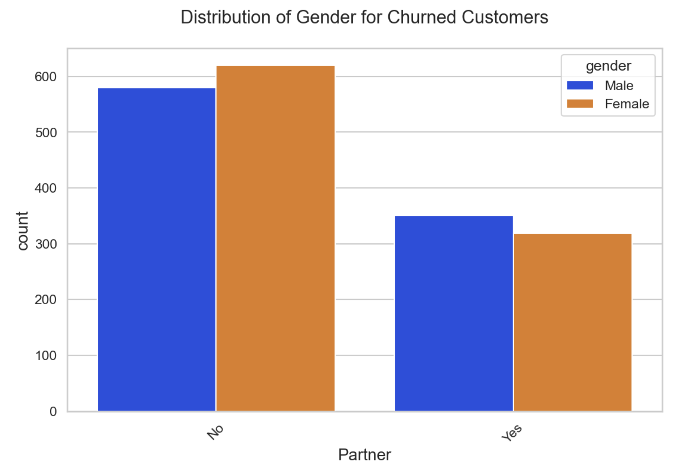
    </td>
  </tr>

  <tr>
    <td width="50%" valign="top">

### 2. Distribution of Payment Method for Churned Customers

- Customers using electronic check show higher churn  
- Auto-payment methods have lower churn  
- Payment behavior plays an important role  

    </td>
    <td width="50%" valign="top">
      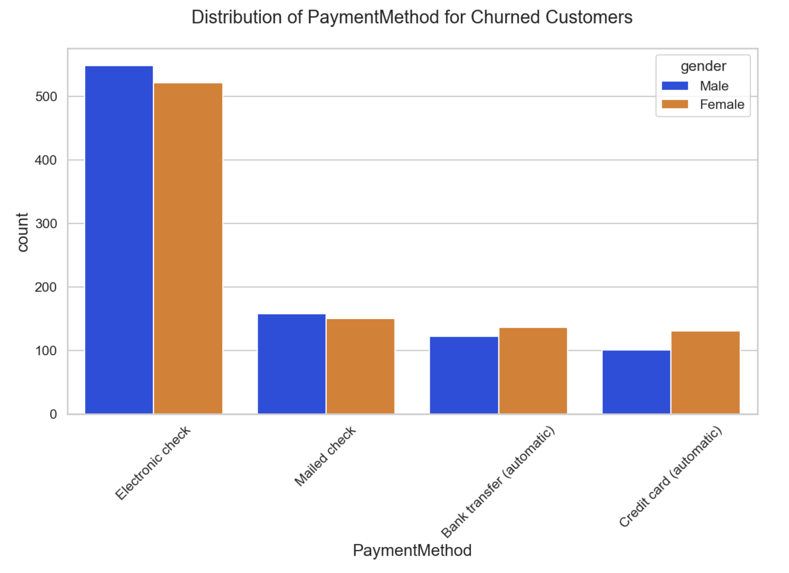
    </td>
  </tr>

  <tr>
    <td width="50%" valign="top">

### 3. Distribution of Contract for Churned Customers

- Month-to-month contracts have the highest churn  
- Long-term contracts (1–2 years) reduce churn  
- Contract type is a strong predictor  

    </td>
    <td width="50%" valign="top">
      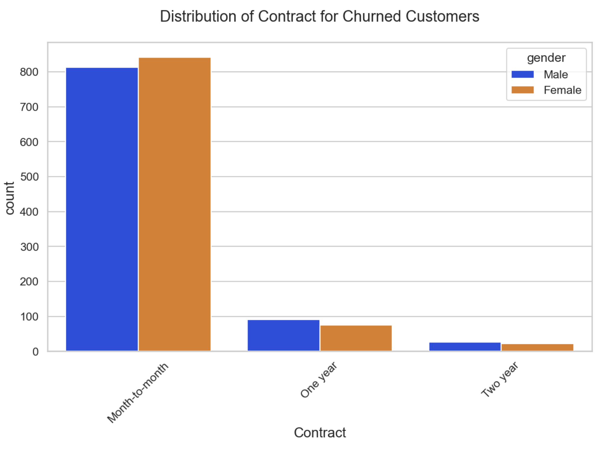
    </td>
  </tr>

  <tr>
    <td width="50%" valign="top">

### 4. Distribution of Tech Support for Churned Customers

- Customers without tech support churn more  
- Tech support improves customer retention  
- Service quality is important for loyalty  

    </td>
    <td width="50%" valign="top">
      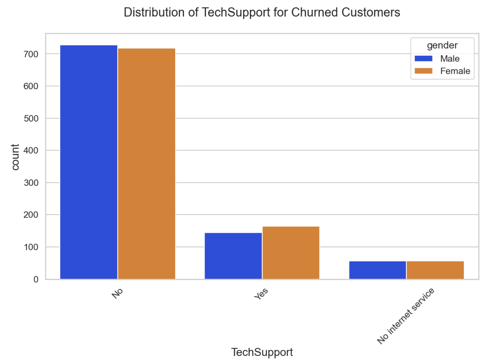
    </td>
  </tr>

  <tr>
    <td width="50%" valign="top">

### 5. Distribution of Senior Citizen for Churned Customers

- Senior citizens have slightly higher churn  
- Indicates need for targeted services  
- Age group impacts retention behavior  

    </td>
    <td width="50%" valign="top">
      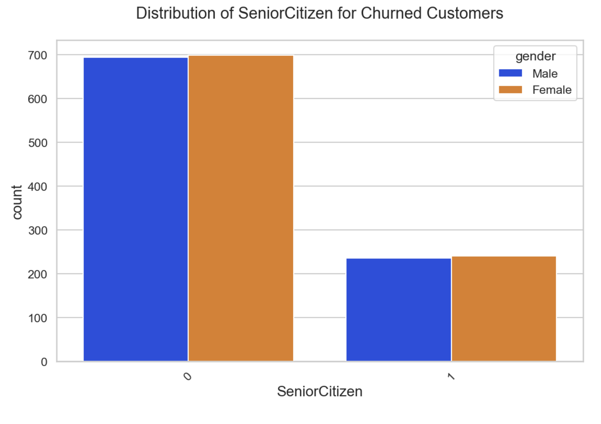
    </td>
  </tr>

</table>

---

## Technical Implementation

-   **Environment:** Jupyter Notebook (VS Code) for analysis and model building, Streamlit for deployment
-   **Language:** Python

### Libraries & Tools Used

-   **Data Processing:** Pandas, NumPy
-   **Data Visualization:** Matplotlib, Seaborn
-   **Machine Learning:** Scikit-learn (AdaBoost Classifier, preprocessing, evaluation)
-   **Model Persistence:** Joblib
-   **Web App Framework:** Streamlit

---

## ⚠️ Challenges & Solutions

### 🔴 Challenge 1: Data Quality Issues

-   `TotalCharges` column contained missing and non-numeric values
    
-   This caused errors during preprocessing
    

✅ **Solution:**

-   Converted column to numeric using `pd.to_numeric(errors='coerce')`
    
-   Removed missing values to ensure clean dataset
    

---

### 🔴 Challenge 2: Categorical Data Handling

-   Many features were in text format
    
-   Machine learning models require numerical input
    

✅ **Solution:**

-   Applied **One-Hot Encoding** using `pd.get_dummies()`
    
-   Used `drop_first=True` to avoid multicollinearity
    

---

### 🔴 Challenge 3: Feature Scaling

-   Features had different ranges (e.g., tenure vs charges)
    
-   This affected model performance
    

✅ **Solution:**

-   Applied **StandardScaler** to normalize feature values
    
-   Ensured consistent scaling during training and prediction
    

---

### 🔴 Challenge 4: Model Selection & Stability

-   Initially explored advanced models like XGBoost
    
-   Faced dependency and environment compatibility issues
    

✅ **Solution:**

-   Selected **AdaBoost Classifier** for stability and performance
    
-   Achieved reliable results with simpler implementation
    

---

### 🔴 Challenge 5: Environment Conflicts

-   Faced issues due to mixing **Anaconda and virtual environments**
    
-   Errors like NumPy mismatch and XGBoost failures occurred
    

✅ **Solution:**

-   Switched to **uv-based clean virtual environment**
    
-   Ensured consistent library versions across the project
    

---

### 🔴 Challenge 6: Deployment Compatibility

-   Streamlit Cloud does not fully support `pyproject.toml`
    
-   Dependency installation failed initially
    

✅ **Solution:**

-   Generated `requirements.txt` from project dependencies
    
-   Used minimal required libraries for faster deployment
    

---

### 🔴 Challenge 7: Consistency Between Training & Prediction

-   Risk of mismatch between training data preprocessing and app input

✅ **Solution:**

-   Replicated the same preprocessing pipeline in Streamlit app
    
-   Ensured identical feature engineering and scaling
    

---

## 💡 Key Takeaway

This project demonstrates the ability to:

-   Handle real-world data challenges
    
-   Debug environment and dependency issues
    
-   Build stable and deployable machine learning systems
    
-   Deliver business-ready solutions
    

---

## 👤 Connect With Me

-   📧 Email: [pushpaneupane710@gmail.com](mailto:pushpaneupane710@gmail.com)
-   💼 LinkedIn: [Pushpa Neupane](https://www.linkedin.com/in/pushpa-neupane-5759a6263/)